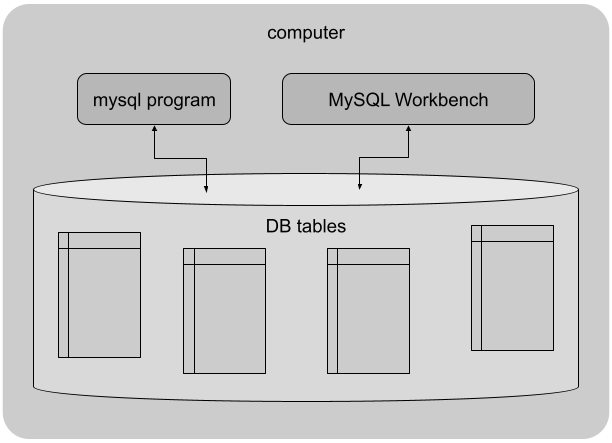

# MySQL-connecting

My notes on the entire process of installing and connecting to a MySQL server

- [MySQL-connecting](#mysql-connecting)
  - [MySQL](#mysql)
    - [MySQL vs Microsoft SQL](#mysql-vs-microsoft-sql)
  - [Overview](#overview)
  - [Download](#download)
  - [Starting the Server](#starting-the-server)
  - [Setup](#setup)
  - [Connecting](#connecting)
  - [Basic SQL Commands](#basic-sql-commands)

## MySQL

[MySQL](https://www.mysql.com/) is a table-based relational database. This means that each column in the table has a category, or type of data that it can contain. Each row is considered an entry in the table. It is common for databases to have many tables for different needs such as product listings and purchases.

### MySQL vs Microsoft SQL

MySQL is open-source and free to use. Microsoft offers their own version of SQL, [MSSQL](https://www.microsoft.com/en-us/sql-server/sql-server-2019), which is free in the *Express* version.

I will focus on the open-source MySQL version.

## Overview

Heres a rough outline of how MySQL looks on the computer:



The computer will run requests through the *mysql server*, which is built into MySQL downloads.

When the server is running, users can access data based on the permissions of their assigned role.

## Download

1. The community version of MySQL can be found [here](https://dev.mysql.com/downloads/installer/)
2. Run the installer, choosing default options
   - It should include the server, router, shell, and the workbench GUI
   - Note the *Server Port* field in the Server>Connectiviy menu. It should be set to *3306* by default.
   - There is an opportunity to set the *root* password. This is the default user for the DB on the server computer.

## Starting the Server

By default, the mysql server will run on startup of the computer, but can be started manually from the Windows Services menu under SQL Server (*servername*). The service should be restarted after changing properties such as enabling TCP/IP protocols.

See the MySQL *Getting Started* page [here](https://dev.mysql.com/doc/mysql-getting-started/en/)

## Setup

If you were not able to setup a *root* password in the installation wizard (the case for Windows), run the mysql command line client and enter the command to prompt setting a password:

```shell
mysql> -u root -p
```

After initial login, the password can be changed with the command:

```shell
ALTER USER 'root'@'localhost' IDENTIFIED BY 'new_password';
```

Permissions and Users can be changed by opening the MySQL Workbench and editing the *Server > Users and Privileges*

For more help on non-Windows installs, see [this](https://dev.mysql.com/doc/mysql-getting-started/en/) page

## Connecting

See these pagecs on [creating a new connection](https://dev.mysql.com/doc/workbench/en/wb-mysql-connections-new.html) and [verifying the connection](https://www.mysqltutorial.org/getting-started-with-mysql/connect-to-mysql-server/)

## Basic SQL Commands

SQL stands for *Structured Query Language*, and defines the syntax for querying databases to retrieve data, and write entries.
A basic list of commands can be found [here](./docs/commands.md), with more comprehensive explanations on the MySQL getting started page [here](https://dev.mysql.com/doc/mysql-getting-started/en/)
