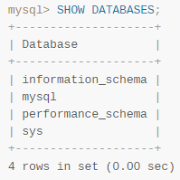
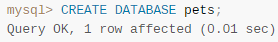
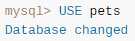
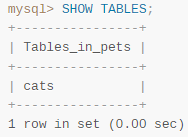
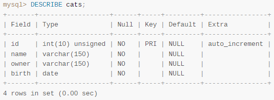
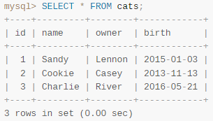
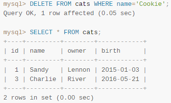

# MySQL Commands

- best to perform these in the MySQL Workbench, but can be done in the command line, or via connection to the server
- types in all caps
- ended with semi-colons

| Command | Output |
| :-- | :-: |
| `mysql> SHOW DATABASES;` |  |
| `mysql> CREATE DATABASE <dbname>;` |  |
| `mysql> USE <dbname>;` |  |
| `mysql> SHOW TABLES;` |  |
| `mysql> DESCRIBE <tableName>;` |  |
| `mysql> SELECT * FROM <tableName>;` |  |
| `mysql> DELETE FROM <tableName> WHERE <columnName> = '<value>';` |  |

see the manual [here](./MySQL-Getting%20Started%20with%20MySQL%20manual.pdf) in this repo under *docs/*
